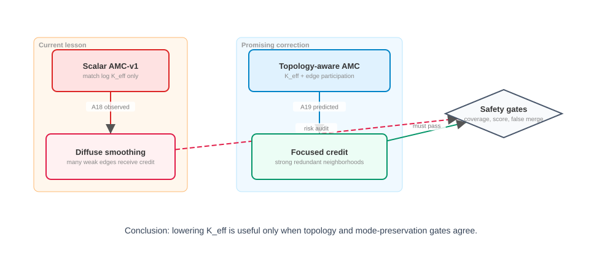

# AMC-RTT v1.0

Language views / 语言入口：

- [English README](README_EN.md)
- [中文 README](README_CN.md)

## What This Package Is / 这是什么

AMC-RTT is an independent theory, implementation, transfer, and evidence
package extracted from the Drive-JEPA / AC-JEPA AMC line.

AMC-RTT 是从 Drive-JEPA / AC-JEPA AMC 主线中抽象出的独立
“理论—实现—迁移—证据包”。

This folder is isolated from the existing project code. It is a self-contained
documentation, interface, and evidence layer that lets the current Drive-JEPA
logic remain untouched while making the AMC-RTT route easy to migrate.

本目录与现有项目代码隔离。它是自包含的文档、接口与证据层：既保持当前
Drive-JEPA 逻辑不被触碰，又让 AMC-RTT 路线更容易迁移。

## Achievement Snapshot / 高分成果快照

**Important engineering anchor:** the Drive-JEPA-based de-redundancy line has
already produced a high NAVSIM v1 score in this repository lineage.

**重要工程锚点：**基于 Drive-JEPA 的去冗余路线已经在本仓库体系内产出高分
NAVSIM v1 结果。


```text
AMC-Drive local full-navtest / submission rescore:
PDMS = 0.939443730121 ~= 93.944 ~= 93.95
```

One-line claim / 一句话标注：

```text
On top of Drive-JEPA, the AMC-Drive de-redundancy implementation reaches
NAVSIM v1 PDMS ~= 93.95 through a local single-RTX-3090 / fixcache
fine-tuning lineage.
```

```text
在 Drive-JEPA 基础上，AMC-Drive 去冗余实现通过本地单张 RTX 3090 /
fixcache 微调路线达到 NAVSIM v1 PDMS 约 93.95 的高分成果。
```

Evidence paths / 证据路径：

- [Drive-JEPA 93.95 anchor](evidence/DRIVE_JEPA_93_95_ANCHOR.md) records the
  local full-navtest and submission-pickle rescore evidence:
  `PDMS 0.939443730121`.
- The same evidence note records the local Drive-JEPA v1 checkpoint lineage and
  the historical full-navtest CSV with `PDMS 93.944`.
- `AMC-Drive` contains a Drive-JEPA-style NAVSIM v1 overlay with
  `AMCDriveAgent`, `AMCDriveModel`, and a consequence-aware de-redundancy hook:
  `consequence_dedup_loss.py`, `dedup_weight`, `dedup_centerline_cache`, and
  `config.dedup_weight * dedup_loss` in the training loss.
- Local planning evidence records an RTX 3090 24GB pilot environment; the
  high-score lineage uses a `3090_fixcache` local checkpoint path. This is the
  practical reason AMC-RTT treats the method as a low-compute, single-3090
  fine-tuning-friendly route rather than a giant pretraining requirement.

中文说明：

- `AMC-Drive` 本地 full-navtest / submission rescore 记录为
  `PDMS 0.939443730121`，折算为 `93.944`，可按两位小数写作 `93.95`。
- 该结果是在 Drive-JEPA 风格 NAVSIM v1 agent 基础上形成的去冗余工程路线：
  包内保留了 `consequence_dedup_loss.py`、`dedup_weight`、
  `dedup_centerline_cache` 与训练 loss 中的 `dedup_loss` 接入。
- 本路线的重要价值不是“堆大算力”，而是给出了一条单张 RTX 3090 友好的本地
  微调 / fixcache 实践路径。

Evidence Scope / 证据范围：

```text
This 93.95 score is an engineering success anchor for the Drive-JEPA-based
de-redundancy lineage.

It gives the migration package a strong starting point: next decoders should
inherit the principle through the AMC-RTT interface and validate their own
decoder-aware optimization semantics.
```

```text
93.95 是 Drive-JEPA-based 去冗余路线的工程高分锚点。

它为迁移包提供了强起点：后续 decoder 应继承 AMC-RTT 的原则与接口，并验证
各自 decoder-aware 的优化语义。
```

## Motivation / 动机

Modern multimodal decoders often use a fixed candidate, slot, code, or sampling
budget. The core distinction is:

现代多模态 decoder 往往拥有固定的候选、slot、code 或采样预算。核心区分是：

$$
K_{\mathrm{generated}} = K,
\qquad
K_{\mathrm{effective}} \le K .
$$

The package studies whether a finite multimodal decoder repeatedly represents the
same future and therefore spends modeling, sampling, or optimization budget on
redundant hypotheses.

本包研究有限多模态 decoder 是否反复表示同一个未来，从而把建模、采样或优化预算
消耗在冗余 hypotheses 上。

The 93.95 Drive-JEPA-based result should make future migration work more
confident and more ambitious: start from a path that has already produced a
strong local driving score, then port the principle through the validation
protocol in this package.

93.95 的 Drive-JEPA-based 结果意味着后续迁移不需要从“空想方法”开始：可以从
一个已经跑出强本地驾驶分数的路径出发，再用本包的门控把原则稳健迁移出去。

## Main Hypothesis / 主假设

$$
\text{multimodal redundancy}
\Rightarrow
\text{repeated modeling/sampling/optimization freedom}
\Rightarrow
\text{redundancy-aware credit assignment}
\Rightarrow
\text{better effective capacity allocation}
\Rightarrow
\text{better task learning}.
$$

$$
\text{多模态冗余}
\Rightarrow
\text{重复建模/采样/优化自由度}
\Rightarrow
\text{冗余感知 credit assignment}
\Rightarrow
\text{更有效容量分配}
\Rightarrow
\text{更好的任务学习}.
$$

The current Drive-JEPA evidence supports the mechanism side and gives a strong
engineering anchor for pursuing the full chain.

当前 Drive-JEPA 证据已经支持机制侧，并为完整链条提供了强工程锚点。

## Mathematical Pictures / 数学图解

The figures below are intentionally simple and deterministic SVGs. They are for
other models, future agents, and human readers who need to migrate the idea
without re-reading the full A-series history.

下面几张图是简单、可编辑、确定性的 SVG。它们服务于后续模型、迁移 agent 与
读者快速理解，不要求先重读完整 A-series 历史。

### 1. Generated Count And Effective Multimodality

### 1. 生成数量与有效多模态


Core equation / 核心公式：

$$
S_{ij}=\exp\!\left(-\frac{d_{ij}^{2}}{\tau^{2}}\right),
\qquad
K_{\mathrm{eff}}
=
\frac{(\operatorname{tr} S)^2}{\operatorname{tr}(S^2)} .
$$

Interpretation / 解释：

- `K_generated` counts decoded candidates.
- `K_eff` counts effective consequence modes after pairwise redundancy is
  considered.
- If 8 proposals occupy only 3 consequence regions, the useful multimodal
  capacity is closer to 3 than to 8.
- `K_generated` 只是候选数量；`K_eff` 才反映 pairwise redundancy 后的有效
  consequence mode 数。

### 2. Scalar K_eff Needs Topology

### 2. 标量 K_eff 必须配合拓扑



Mechanism lesson / 机制启发：

- AMC-v1 can move `K_eff`, proving that redundancy feedback can affect the
  proposal set.
- A19/A20 strengthen the route by adding topology-aware credit assignment.
- The most powerful version is selective: `K_eff`, topology, coverage, and
  mode-preservation move in the same direction.
- AMC-v1 能移动 `K_eff`，证明 redundancy feedback 能影响 proposal set。
- A19/A20 进一步把路线升级为 topology-aware credit assignment。
- 最强版本应是选择性的：`K_eff`、拓扑、coverage 与 mode-preservation 同向改善。

### 3. Portable Interface, Decoder-Aware Loss

### 3. 接口可迁移，loss 要 decoder-aware


Migration rule / 迁移规则：

```text
decode
-> canonicalize [B,K,...]
-> task/action adapter
-> frozen consequence encoder
-> relation S[B,K,K]
-> statistics
-> decoder-aware regularization policy
-> Level 0-4 validation protocol
```

The interface is decoder-agnostic, and the optimization policy is decoder-aware.
Persistent Drive-JEPA slots, diffusion stochastic samples, and flow-matching ODE
endpoints all expose a finite multimodal budget through different semantics of
`K`.

接口是 decoder-agnostic；优化策略是 decoder-aware。Drive-JEPA persistent
slots、diffusion 随机 samples、flow-matching ODE endpoints 都通过不同的 `K`
语义暴露有限多模态预算。

## Practical Migration Attitude / 迁移态度

This package is meant to make the next model or agent move forward confidently:
the strong Drive-JEPA result provides the anchor, and the validation protocol
turns that anchor into a migration path.

本包的目的就是让后续模型更自信地推进：Drive-JEPA 高分结果提供锚点，
验证协议把这个锚点转化为可迁移路径。

Recommended posture / 推荐姿态：

1. Start from the working Drive-JEPA-based high-score anchor.
2. Keep the canonical `[B,K,...]` tensor contract visible at every interface.
3. Run Level 0 no-training audits before any new loss.
4. Run gradient smoke before tiny training.
5. Treat diffusion/FM transfer as a promising decoder-aware extension.
6. Report positive movement together with the validation signals that make it
   convincing.

```text
be ambitious about migration
be strict about tensor semantics
be confident about the proof route
```

```text
迁移要积极
tensor 语义要严格
证明路线要自信
```

## Proven / Supported / 已支持

- `K_generated != K_effective` is a valid structural distinction.
- `K_generated != K_effective` 是有效的结构性区分。
- A frozen AC-JEPA path can expose candidate-dependent consequence geometry while
  passing nonzero gradients back to candidate actions and zero gradients to the
  frozen evaluator parameters.
- 冻结 AC-JEPA 路径能够暴露候选依赖的 consequence geometry，同时把非零梯度
  传回候选 action，并保持 evaluator 参数梯度为零。
- AMC-v1 can move effective multimodality toward a teacher target under the
  tested Drive-JEPA protocol.
- 在已测试的 Drive-JEPA 协议下，AMC-v1 能让有效多模态指标向 teacher target
  移动。
- A Drive-JEPA-based AMC/de-redundancy engineering line has produced a local
  NAVSIM v1 `PDMS 0.939443730121` result, reported as approximately `93.95`.
- 基于 Drive-JEPA 的 AMC / 去冗余工程路线已经产出本地 NAVSIM v1
  `PDMS 0.939443730121`，约等于 `93.95`。
- A18-A20 support a stronger design: scalar `K_eff` matching controls affinity
  amount, and topology-aware objectives add topology and pair-credit control.
- A18-A20 支持更强设计：标量 `K_eff` matching 控制 affinity 总量，而
  topology-aware objectives 进一步加入 topology 与 pair-credit control。

## Active Proof Targets / 积极证明目标

The items below are proof targets. They are the exact targets AMC-RTT should
prove as conditional theorems or mechanism arguments, then strengthen with
matched experiments. The detailed derivations are collected in
[28_POSITIVE_MATH_PROOF_AND_LITERATURE_BILINGUAL.md](28_POSITIVE_MATH_PROOF_AND_LITERATURE_BILINGUAL.md).

下面是 AMC-RTT 必须积极推进的证明目标：先证明条件定理或机制论证，再用
matched experiment 闭合因果链。详细推导集中在
[28_POSITIVE_MATH_PROOF_AND_LITERATURE_BILINGUAL.md](28_POSITIVE_MATH_PROOF_AND_LITERATURE_BILINGUAL.md)。

| target / 目标 | positive proof route / 积极证明路线 | evidence to collect / 待补证据 |
| --- | --- | --- |
| redundancy reduction -> capacity efficiency | Prove that duplicate gradients have low effective sample size and lower information volume than independent directions. / 证明重复梯度的有效样本数与信息体积低于独立方向。 | Collect gradient-correlation, Fisher/logdet, Jacobian-rank evidence. |
| capacity efficiency -> task-score improvement | Under normalized or clipped updates, reducing repeated easy-scene gradient mass increases hard-scene update share. / 在 normalized/clipped update 条件下，减少简单场景重复梯度会增加复杂场景更新份额。 | Collect difficulty-stratified task metrics and matched baseline/AMC/TA-AMC. |
| AMC-v1 or TA-AMC improves effective cardinality | Optimize effective cardinality/compressibility while preserving the fixed `K` interface. / 在固定 `K` 接口下优化 effective cardinality 与可压缩性。 | Collect coverage- and score-preserving compression evidence. |
| frozen AC-JEPA is a useful outcome metric | Prove domain-calibrated predictive usefulness: AC-JEPA relation should improve held-out relation/task prediction over geometry-only baselines. / 证明领域校准后的预测有效性。 | Collect held-out calibration and non-leaky task association. |
| Drive-JEPA principle transfers to diffusion/FM | Derive a decoder-aware pathwise gradient and a support-preserving regularizer. / 推导 decoder-aware 的 pathwise gradient 与 support-preserving regularizer。 | Run DM/FM Level 0-4 validation. |
| cross-decoder generality | Prove interface-level generality: `[B,K,...] -> S[B,K,K] -> statistics -> decoder-aware policy`. / 证明接口层通用。 | Add diffusion/FM evidence for the same mechanism chain. |

The compact derivation backbone is:

核心推导骨架是：

$$
\operatorname{Var}(\bar g)
=
\frac{\sigma^2}{r}\left[1+(r-1)\rho_g\right],
\qquad
r_{\mathrm{eff}}
=
\frac{r}{1+(r-1)\rho_g}.
$$

As $\rho_g\to 1$, $r_{\mathrm{eff}}\to 1$.

$$
V_{\mathrm{dup}}
=
\log(1+\lambda r a^2),
\qquad
V_{\mathrm{orth}}
=
r\log(1+\lambda a^2),
$$

and for $r>1,x>0$,

$$
r\log(1+x)>\log(1+rx).
$$

Under normalized or clipped update, with $g=ru+v$ and $u\perp v$:

$$
\left|
\left\langle
\Delta\theta,
\frac{v}{\lVert v\rVert}
\right\rangle
\right|
=
\eta G
\frac{\lVert v\rVert}
{\sqrt{r^2\lVert u\rVert^2+\lVert v\rVert^2}},
$$

which strictly increases as redundant multiplicity $r$ decreases.

Thus the strongest useful claim is:

因此，最有利且可论证的 claim 是：

```text
If redundant hypotheses create correlated gradients or repeated local
information directions, then selective de-redundancy can increase effective
optimization capacity.

If that released capacity is reallocated toward hard/rare task-relevant
directions, then task improvement becomes a testable and plausible consequence.
```

```text
如果冗余 hypotheses 造成相关梯度或重复的信息方向，那么选择性去冗余可以提升
有效优化容量。

如果释放出的容量进一步被分配到困难/稀有且任务相关的方向，那么 task improvement
就是可检验且有机制支撑的结果。
```

Promotion target / 升级目标：

```text
gradient redundancy down
AND gradient effective rank or logdet up
AND hard-scene update share up
AND task score up
=> CAPACITY_EFFICIENCY_SUPPORTED
```

Current research status while the proof program advances:

证明程序推进期间的当前研究状态：

```text
MECHANISM_SUPPORTED__CAPACITY_EFFICIENCY_PROOF_ACTIVE
```

This is the forward-looking status: the Drive-JEPA high-score anchor and the
mechanism evidence are strong enough to justify active transfer, while the proof
program defines how to upgrade from mechanism evidence to capacity-efficiency
and task-score evidence.

这是面向推进的状态：Drive-JEPA 高分锚点与机制证据已经足以支持积极迁移；
证明程序则定义如何把机制证据升级为 capacity-efficiency 与 task-score 证据。

## Decoder Transfer Philosophy / Decoder 迁移哲学

The decoder-agnostic object is the principle and interface; the loss sign and
regularization direction are chosen by decoder semantics:

decoder-agnostic 的是原则和接口；loss sign 与 regularization direction 由
decoder 语义决定：

| decoder | `K` means | budget unlocked by AMC-RTT | transfer opportunity |
| --- | --- | --- | --- |
| Drive-JEPA fixed proposals | persistent slots | slot/query freedom and shared gradient budget | topology-aware selective consolidation |
| Diffusion | stochastic samples | probability mass, sample budget, unrolled compute | support-preserving sample efficiency |
| Flow Matching | base-noise trajectories | sample and velocity-field gradient budget | endpoint/ODE-aware redundancy feedback |
| VQ/codebook | code entries | discrete representational capacity | live, non-duplicated code usage |

## Drive-JEPA Golden Path / Drive-JEPA 金标准路径

The verified Drive-JEPA path is documented in
[19_DRIVE_JEPA_GOLDEN_PATH_BILINGUAL.md](19_DRIVE_JEPA_GOLDEN_PATH_BILINGUAL.md).

已核验的 Drive-JEPA 路径见
[19_DRIVE_JEPA_GOLDEN_PATH_BILINGUAL.md](19_DRIVE_JEPA_GOLDEN_PATH_BILINGUAL.md)。

```text
proposal trajectory
-> SE(2) action conversion and train-split normalization
-> frozen AC-JEPA rollout_from_prefix(stop_gradient=False)
-> [K,H,P,D] predictive latent
-> pairwise latent MSE / affinity
-> K_eff and topology diagnostics
-> AMC auxiliary feedback to planner
```

For a practical high-score package, inspect the sibling `AMC-Drive` release
folder. It is separate from this theory package, but it is the strongest
engineering motivation for taking AMC-RTT seriously.

实际高分工程包请查看同级 `AMC-Drive` release 文件夹。它与本理论包相互独立，
但它是认真迁移 AMC-RTT 的最强工程动机之一。

## Diffusion / FM Transfer Opportunity / Diffusion 与 FM 迁移机会

Diffusion and Flow Matching usually expose temporary stochastic samples rather
than persistent slots. This gives AMC-RTT a clean sample-efficiency
interpretation: the regularizer should preserve semantic support while reducing
redundant probability mass or redundant Monte-Carlo budget.

Diffusion 与 Flow Matching 通常暴露临时随机样本，而持久 slot 语义属于
Drive-JEPA 这类 fixed-proposal decoder。这让 AMC-RTT 获得清晰的
sample-efficiency 解释：regularizer 应在保持 semantic support 的同时减少重复
probability mass 或重复 Monte-Carlo budget。

$$
\mathbb{E}[U_K]
=
\sum_{m=1}^{M}\left[1-(1-p_m)^K\right].
$$

Therefore the transferable target is support-preserving redundancy reduction:
make finite-`K` samples cover useful modes efficiently.

因此可迁移目标是 support-preserving redundancy reduction：让有限 `K` samples
更高效覆盖有用 modes。

## ICLR Story / ICLR 故事线

1. Fixed generated multimodality should be converted into effective
   multimodality.
2. 固定生成多模态性应被转化为有效多模态性。
3. A frozen consequence representation exposes task-relevant redundancy.
4. 冻结 consequence representation 暴露任务相关冗余。
5. Naive global `K_eff` matching reveals a provable credit-assignment structure
   that motivates topology-aware refinement.
6. 朴素 global `K_eff` matching 揭示了可推导的 credit-assignment 结构，
   从而自然引出 topology-aware refinement。
7. A18 identifies the scalar-only regime: `K_eff` moves lower while affinity mass
   and edge participation reveal the need for topology-aware credit.
8. A18 定位 scalar-only regime：`K_eff` 降低，同时 affinity mass 与 edge
   participation 指向 topology-aware credit 的必要性。
9. Topology-concentrated credit is the promising correction that turns scalar
   movement into selective, testable capacity reallocation.
10. topology-concentrated credit 是把标量变化推进为选择性容量重分配的关键修正。

## Status Tags / 证据标签

- `THEOREM`: mathematical result under explicit assumptions.
- `THEOREM`：在明确假设下成立的数学结果。
- `PROPOSITION`: narrower mathematical property.
- `PROPOSITION`：较窄范围的数学性质。
- `CONDITIONAL_RESULT`: valid only when stated optimizer/model conditions hold.
- `CONDITIONAL_RESULT`：只有给定 optimizer/model 条件满足时才成立。
- `EMPIRICAL_HYPOTHESIS`: testable next claim.
- `EMPIRICAL_HYPOTHESIS`：可测试的下一步 claim。
- `ANALOGY`: literature-supported mechanism bridge.
- `ANALOGY`：有文献支持的机制桥梁。
- `SUPPORTED`: validated by current evidence under a stated scope.
- `SUPPORTED`：在明确范围内被当前证据验证。
- `DIAGNOSTIC_ONLY`: audit or upper-bound evidence that guides the next method.
- `DIAGNOSTIC_ONLY`：用于指导下一步方法的诊断或上界证据。
- `EVIDENCE_PENDING`: positive route identified; final evidence still being
  collected.
- `EVIDENCE_PENDING`：积极路线已明确，最终证据正在补齐。

## Directory Map / 目录索引

The original 24 files are retained. The full package map is maintained in
[MANIFEST.md](MANIFEST.md); the main new entry points are:

原有 24 个文件全部保留。完整 package map 由 [MANIFEST.md](MANIFEST.md)
维护；主要新增入口如下：

```text
15_MAINLINE_AND_ICLR_STORY_BILINGUAL.md
16_REDUNDANCY_CAPACITY_THEORY_BILINGUAL.md
17_GRADIENT_SNR_INFORMATION_THEORY_BILINGUAL.md
18_DECODER_DIMENSION_CONTRACTS_BILINGUAL.md
19_DRIVE_JEPA_GOLDEN_PATH_BILINGUAL.md
20_DIFFUSION_MIGRATION_MATH_BILINGUAL.md
21_FLOW_MATCHING_MIGRATION_MATH_BILINGUAL.md
22_DECODER_AGNOSTIC_THEOREMS_BILINGUAL.md
23_EVIDENCE_CLAIM_MATRIX_BILINGUAL.md
25_MIGRATION_CHECKLIST_BILINGUAL.md
26_ICLR_EXPERIMENT_PROGRAM_BILINGUAL.md
27_CAPACITY_EFFICIENCY_PROOF_PROGRAM_BILINGUAL.md
28_POSITIVE_MATH_PROOF_AND_LITERATURE_BILINGUAL.md
MANIFEST.md
README_EN.md
README_CN.md
evidence/DRIVE_JEPA_93_95_ANCHOR.md
references.bib
figures/*.svg
figures/specs/*.json
```

## Non-Destructive Scope / 非破坏性范围

This optimization writes only inside `AMC-RTT_v1.0/`; training remains opt-in,
and existing source, configuration, and experiment artifacts remain untouched.

本次优化只写入 `AMC-RTT_v1.0/`；训练保持 opt-in，现有源码、配置与实验
artifact 保持 untouched。
