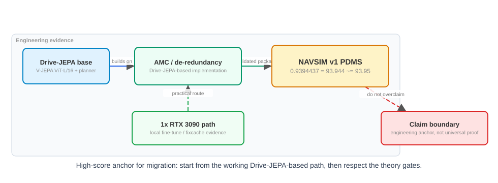
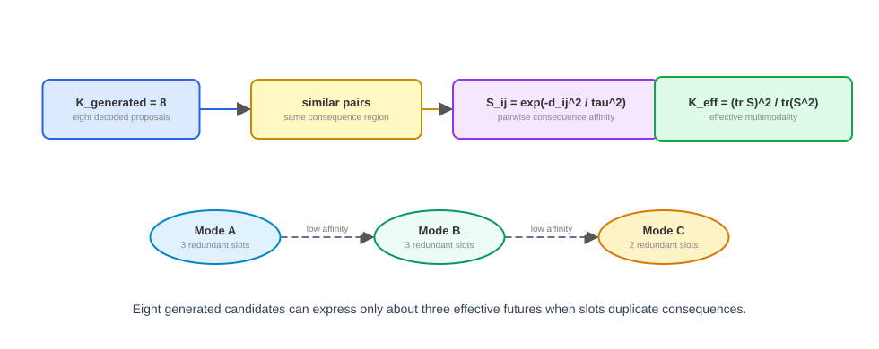
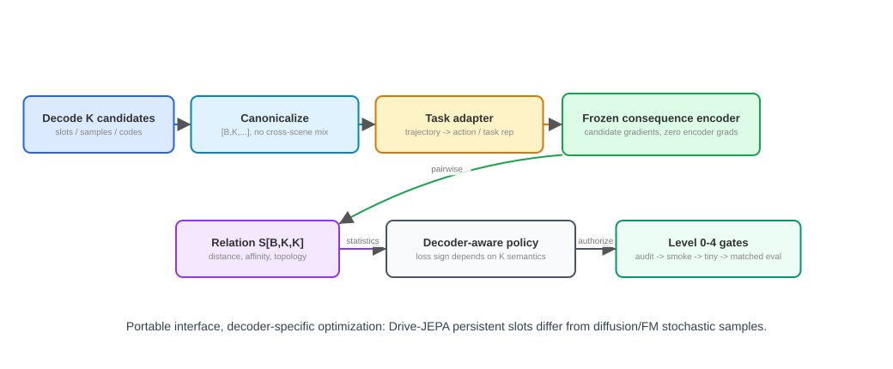

# AMC-RTT v1.0

AMC-RTT 是一个面向 redundancy-aware multimodal generation 的理论、实现、
迁移与证据包。核心原则很直接：

```text
别让有限多模态 decoder 把建模能力、采样预算和梯度预算反复花在同一个未来上。
```

## 高分成果锚点

在 Drive-JEPA 基础上，AMC-Drive 去冗余实现达到：

```text
NAVSIM v1 PDMS = 0.939443730121 ~= 93.944 ~= 93.95
```

这是本地单张 RTX 3090 / fixcache 微调 lineage。见
[evidence/DRIVE_JEPA_93_95_ANCHOR.md](evidence/DRIVE_JEPA_93_95_ANCHOR.md)。



## 为什么冗余重要

现代多模态 decoder 往往暴露一个固定预算：

```text
K_generated = K
K_effective <= K
```

目标是把“生成出来的多模态”转化为“真正有效的多模态”：减少重复 hypotheses，
同时保持有用 semantic support。



## 核心机制

```text
多模态冗余
-> 重复的建模 / 采样 / 优化自由度
-> 冗余感知的梯度 credit assignment
-> 更有效的容量分配
-> 更好的任务学习
```

最强证明路线需要同时出现：

```text
gradient redundancy down
AND gradient effective rank or logdet up
AND hard-scene update share up
AND task score up
=> CAPACITY_EFFICIENCY_SUPPORTED
```

## Decoder 迁移

AMC-RTT 在接口层是 decoder-agnostic，在优化层是 decoder-aware：

```text
decode
-> canonicalize [B,K,...]
-> task/action adapter
-> frozen consequence encoder
-> relation S[B,K,K]
-> statistics
-> decoder-aware regularization policy
-> Level 0-4 validation protocol
```



Diffusion 与 Flow Matching 是非常值得推进的扩展方向，关键是使用
support-preserving、sample-efficiency-aware 的 regularizer。

## 数学图解

- [fig1_high_score_anchor.svg](figures/fig1_high_score_anchor.svg)
- [fig2_keff_intuition.svg](figures/fig2_keff_intuition.svg)
- [fig3_credit_assignment.svg](figures/fig3_credit_assignment.svg)
- [fig4_decoder_transfer_pipeline.svg](figures/fig4_decoder_transfer_pipeline.svg)

可编辑 FigureSpec 源文件在 [figures/specs](figures/specs)。

## 入口文件

- [README.md](README.md)：中英文主 README。
- [README_EN.md](README_EN.md)：英文 README。
- [MANIFEST.md](MANIFEST.md)：文件地图与 claim level。
- [interfaces/redundancy_api.py](interfaces/redundancy_api.py)：独立
  decoder-agnostic API。
- [27_CAPACITY_EFFICIENCY_PROOF_PROGRAM_BILINGUAL.md](27_CAPACITY_EFFICIENCY_PROOF_PROGRAM_BILINGUAL.md)：
  capacity efficiency 与 task improvement 的证明程序。

## 当前状态

```text
MECHANISM_SUPPORTED__CAPACITY_EFFICIENCY_PROOF_ACTIVE
```

Drive-JEPA 高分锚点与机制证据已经让 AMC-RTT 具备积极迁移的基础。本包的证明程序
定义了从机制证据推进到 capacity-efficiency 与 task-score 证据的高效路径。
